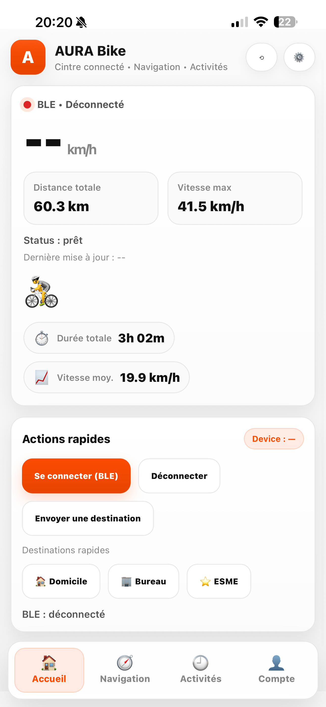
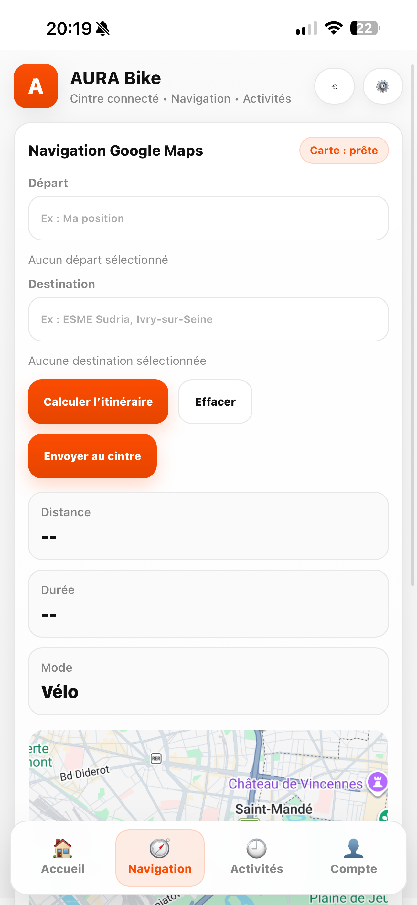
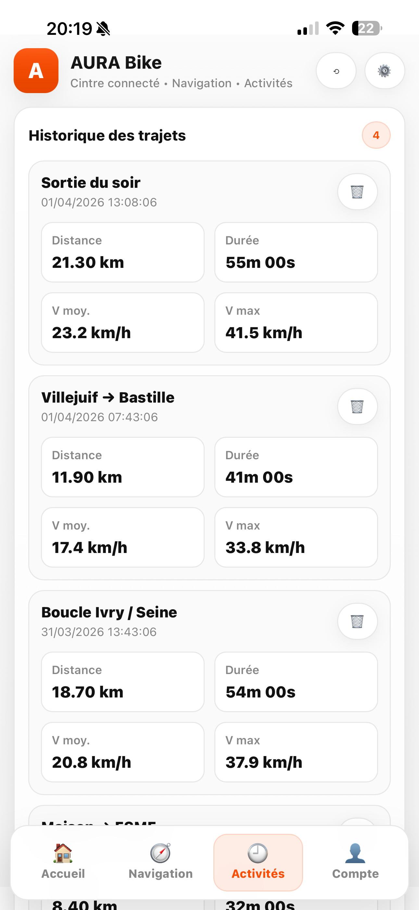

# 🚴‍♂️ AURA Bike — Embedded Smart Handlebar System


> Smart embedded system for cyclist safety, navigation and real-time perception.

---

## 📌 Overview

AURA Bike is an embedded system designed to enhance cyclist safety using:
- real-time sensor fusion,
- GNSS navigation,
- rear perception (camera + LiDAR),
- multi-display interface,
- wireless communication with a mobile application.

The system is based on a **distributed architecture using multiple ESP32-S3 microcontrollers**, each handling a specific subsystem.

---

## 🧠 System Architecture

The system is divided into **two main modules**:

### 1. 🚴 Smart Handlebar
- ESP32-S3 (main processing unit)
- TFT displays (SPI)
- GY-86 (IMU + barometer + magnetometer)
- GNSS (via ESP32-S3 4G LTE)
- User interface & navigation
- BLE / Wi-Fi communication

### 2. 📷 Rear Perception Module
- ESP32-CAM
- OV2640 camera
- TF-Luna LiDAR
- Rear environment detection
- Wireless data transmission to handlebar

Multi-node architecture allows load distribution and real-time processing.

---

## ⚙️ Key Features

### 🔍 Sensor Fusion
- IMU (acceleration, rotation)
- Magnetometer (heading)
- Barometer (altitude)
- GNSS (position & speed)

### 🧭 Navigation
- GPS-based navigation
- GPX route handling
- Directional guidance (arrows, distance)

### ⚠️ Safety & Detection
- Rear vehicle detection (camera + LiDAR)
- Distance estimation
- Risk evaluation (Time-To-Collision logic)
- Fall / shock detection

### 📊 Real-Time Data
- Speed
- Distance
- Altitude
- Slope
- Heading
- Battery level

### 📱 Connectivity
- BLE communication with smartphone
- Wi-Fi / 4G support
- Mobile app integration

---

## 📸 Prototype Photos

### Functional Prototype
<p align="center">
  
</p>

### Smart Handlebar
<p align="center">
  
</p>

<p align="center">
  
</p>

<p align="center">
  
</p>

### Rear Perception Module
<p align="center">
  
</p>

### Mobile Application
<p align="center">
  
  
  
</p>

---

## 🧩 Hardware Components

| Component | Role |
|---|---|
| ESP32-S3 | Main MCU (processing + display + communication) |
| ESP32-CAM | Camera processing |
| OV2640 | Image acquisition |
| TF-Luna LiDAR | Distance measurement |
| GY-86 | IMU + barometer + magnetometer |
| TFT Displays | User interface |
| GNSS Module | Position & navigation |
| Battery + BMS | Power management |

---

## 🔗 Communication Interfaces

| Interface | Usage |
|---|---|
| UART | GNSS, LiDAR |
| I2C | GY-86 sensors |
| SPI | TFT displays |
| BLE | Smartphone communication |
| Wi-Fi | Data transfer / OTA |
| 4G LTE | Extended connectivity |

---

## 🔄 Data Pipelines

### 📡 GNSS Pipeline
```text
GNSS → UART → ESP32-S3 → Parser → Navigation → TFT Display
```

### 🧭 IMU Fusion Pipeline
```text
GY-86 → I2C → ESP32-S3 → Filtering → Fusion → Derived metrics
```

### 🚗 Rear Detection Pipeline
```text
Camera → ESP32-CAM → Image stream
LiDAR → ESP32-CAM → Distance
→ Fusion → Risk detection → Alert → Handlebar display
```

---

## 🧪 Embedded Processing

### Sensor Fusion
- IMU + GNSS fusion
- Low-pass / complementary filtering
- Slope & orientation estimation

### Event Detection
- Fall detection
- Braking detection
- Rear approach detection

### AI-ready Pipeline (Prototype)
- Object detection (camera)
- Distance estimation (LiDAR)
- Time-To-Collision estimation
- Risk level classification

---

## 🧵 Software Architecture

Built using:
- **C**
- **ESP-IDF**
- **FreeRTOS**

### Core Modules
- `navigation` → GNSS parsing & routing
- `gy86` → IMU & barometric processing
- `display` → TFT interface
- `ble` → smartphone communication
- `camera/lidar` → rear perception
- `main` → system orchestration

### Key Concepts
- Multi-tasking (FreeRTOS)
- Modular firmware design
- Hardware abstraction
- Real-time processing

---

## 📱 Mobile Application Integration

The system interacts with a mobile app for:
- route planning,
- GPX conversion and transfer,
- ride history,
- BLE communication.

---

## 🎯 Performance Targets

- Alert latency: < 200 ms
- Sensor rate: > 10 Hz (LiDAR)
- Display refresh: ~5–10 FPS
- Autonomy: ~7–10 hours

---

## ⚠️ Current Limitations

- Prototype-level mechanical integration
- Power consumption optimization needed
- Limited LiDAR range
- AI processing not fully optimized
- Environmental robustness not fully validated

---

## 🚀 Future Improvements

- 360° detection system
- Anti-theft GPS tracking
- Adaptive lighting
- Improved AI latency & reliability
- Enhanced UI/UX
- Full system integration & industrialization

---

## 👨‍💻 Authors

- Sandric Bretecher : Embedded Systems / R&D Electronics Engineer (LinkedIn : https://www.linkedin.com/in/sandric-b-763a65197/)
- Clément Chanvalon : R&D Engineer, Battery Architecture and Power Electronics (LinkedIn : https://www.linkedin.com/in/clement-chanvalon/)
- Line Hoffmeyer-Kuntz : Hardware & Software Engineer (LinkedIn : https://www.linkedin.com/in/line-hoffmeyer-kuntz-563905222/)

---

## 📄 License

Academic project — usage may be restricted.

---

## ⭐ Project Context

Final-year engineering project at **ESME** in **Embedded Systems & Intelligent Transport**.
